# Sistema de Comunicación LoRa P2P con FreeRTOS (Dual Core)
**Maestría en Internet de las Cosas (IoT)** **Asignatura:** Sistemas de Sensores  
**Autor:** MGTI. Saul Isai Soto Ortiz

## 📋 Descripción del Proyecto
Este proyecto implementa un protocolo de comunicación **Punto a Punto (P2P)** utilizando modulación LoRa sobre un sistema operativo en tiempo real (**FreeRTOS**). 

A diferencia de las implementaciones básicas secuenciales (Super Loop), este código aprovecha la arquitectura **Dual Core** del ESP32-S3 para separar las tareas críticas (Radiofrecuencia) de las tareas de interfaz (Pantalla OLED), garantizando una recepción de datos robusta y sin bloqueos.

### Características Técnicas
* **Hardware:** Heltec WiFi LoRa 32 **V3** (ESP32-S3 + SX1262).
* **Sistema Operativo:** FreeRTOS.
* **Arquitectura:**
    * **Core 0:** Tareas de Radio (RX/TX) protegidas por Mutex.
    * **Core 1:** Tarea de Pantalla (UI) alimentada por Queue.
* **Protocolo:** Encapsulamiento manual de tramas [Destino][Origen][ID][Len][Payload].

---

## 🛠️ Requisitos e Instalación

### 1. Preparación del IDE Arduino (CRÍTICO)
Para evitar errores de compilación con la placa Heltec V3, sigue estos pasos estrictamente:

1.  **Gestor de Tarjetas:**
    * URL Adicional: `https://espressif.github.io/arduino-esp32/package_esp32_index.json`
    * Instalar paquete: **"esp32 by Espressif Systems"**.
    * Versión recomendada: **2.0.17** (Más estable que la 3.0.x para LoRa).
    
2.  **Selección de Placa:**
    * Modelo: `Heltec WiFi LoRa 32 V3`
    * **USB CDC On Boot:** `Enabled` (Necesario para ver mensajes en Serial).

3.  **Librerías (Instalar vía Gestor):**
    * `RadioLib` por Jan Gromeš (Manejo del chip SX1262).
    * `ESP8266 and ESP32 OLED driver for SSD1306 displays` por ThingPulse.
    * *Nota: Si tienes instalada la librería `ESP8266_Oled_Driver...` antigua, BÓRRALA manualmente de Mis Documentos/Arduino/libraries para evitar conflictos.*

---

## 🧠 Arquitectura del Software

El sistema se divide en 3 Tareas (Tasks) independientes:

| Tarea | Núcleo (Core) | Prioridad | Descripción |
| :--- | :---: | :---: | :--- |
| **Tarea RX** | 0 | Alta | Espera un semáforo de la interrupción (ISR). Cuando llega un mensaje, lo lee y lo envía a la Queue. |
| **Tarea TX** | 0 | Media | Se despierta periódicamente para enviar datos simulados. Usa Mutex para no chocar con RX. |
| **Tarea Display** | 1 | Baja | Lee mensajes de la Queue y actualiza la pantalla OLED. Al estar en Core 1, no bloquea la radio. |

### Diagrama de Flujo de Datos

```mermaid
graph LR
    A[Antena LoRa] -- Interrupción --> B(Tarea RX - Core 0)
    C[Sensor Simulado] --> D(Tarea TX - Core 0)
    B -- Queue (Cola) --> E(Tarea Display - Core 1)
    E --> F[Pantalla OLED]
    B -. Mutex .- D
```

